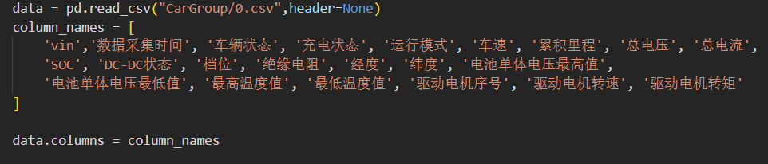
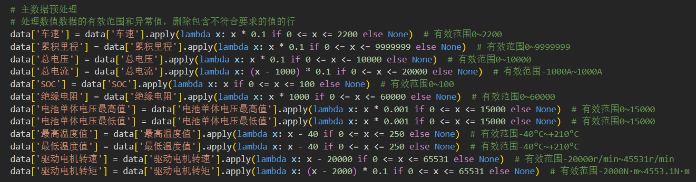

# 2023Fall-GroupProject

## 数据处理

首先分析数据集，一共有两个数据集，数据集"0.csv"记录了标号为vin的车的车速，累积里程等车辆在某时刻的各项状态的数据。数据集"trip_data.csv"记录了标号为vin的车的运行数据采集时间范围和该车在该时间范围内处于什么状态（包括行驶，充电和停车三种状态）。

首先，我们将数据集中“是否买保险”这列删去，因为它显然与该车的剩余可行驶里程无关。

之后正式开始读入数据集，由于原数据集中没有列名，手动赋予每列的名字，如下图所示:

The first step is to analyze the data set. There are two data sets in total. The data set "0.csv" records the speed of the vehicle labeled vin, accumulated mileage and other state data of the vehicle at a certain time. The data set "trip_data.csv" records the time range of the operation data acquisition of the vehicle labeled vin and the state of the vehicle (including driving, charging and parking) during the time range.

First, we deleted the "whether to buy insurance" column from the data set, because it obviously has nothing to do with the remaining distance the car can drive.

After that, the data set is officially read. Since there is no column name in the original data set, the name of each column is manually assigned, as shown in the figure below:

如上述代码所示，利用lambda表达式，根据数据集中所要求的数据的取值范围来初筛数据，将不符合范围的数据给标记为none。

As shown in the above code, using lambda expressions, the data is initially screened according to the value range of the data required in the dataset, and the data that does not fit the range is marked as none.

最后，再统一将所有含有none值（即其中至少一项数据存在问题）的数据全部删除。由此，对数据的初步筛选结束。

Finally, all data with a none value (that is, at least one of the data is faulty) is uniformly deleted. Thus, the preliminary screening of the data is completed.

之后，我们想对上述预处理后的数据进行进一步处理，正如本节一开始所说，我们目前一共需要处理两个数据集，而这两个数据集是通过“vin”这个唯一id连接起来的，我们计划首先在trip_data.csv数据集中筛选出所有处于行驶状态的车，获得其vin值，数据采集的时间范围的信息。然后再“联立”这两个数据集，遍历0.csv数据集中的每一行，找其vin的值是否在经筛选后的trip_data.csv中存在，如果存在，再进一步比较其数据采集时刻是否出在经筛选后的trip_data.csv中的数据采集时间范围之中。由此，我们写出了下面的代码：

After that, we want to further process the pre-processed data above. As mentioned at the beginning of this section, we need to process two data sets, which are connected by the unique id of "vin". We plan to first screen out all the cars in running state in the trip_data.csv data set. Obtain information about its vin value and the time range in which the data was collected. Then, "combine" these two data sets and traverse each row of the 0.csv data set to find out whether its vin value exists in the filtered trip_data.csv. If so, further compare whether its data collection time is in the filtered trip_data.csv data collection time range. From this, we write the following code:

但是该代码运行时间过久，我们没能成功得到运行结果，我们将在中期答辩前进一步优化上述代码，以加快其速率。

However, the code took too long to run and we failed to get the running result. We will further optimize the above code to speed it up before the mid-term defense.

